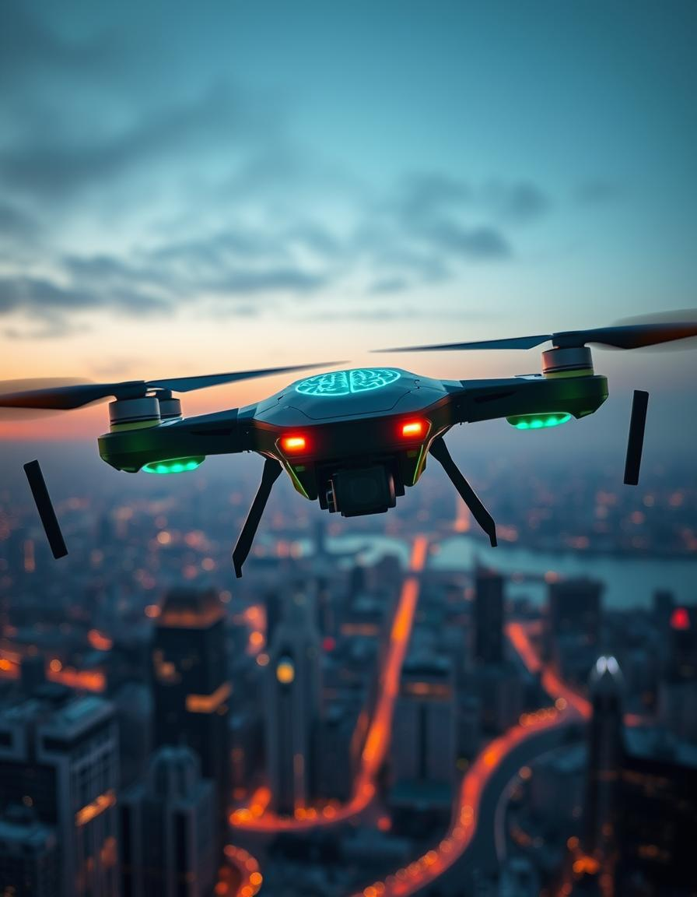

# DroneAgent
DroneAgent - drone autonomy powered by Generative AI

<div align="center">
   
</div>

## Features

- Flying drone fully controlled via Gemini LLM-powered AI agent built using smolagents library (0 human control)
- As input agent receives a text description of the mission and then tries to execute it
- Agent can do basic actions (take off, land, basic movement around) as well as more complex tasks (navigating in the environment, finding things in the surrounding environment - see demo below)
- Agent receives photos from the drone camera at each step of the mission
- Basic agent observability (via `LangFuse`) and terminal logs

## YouTube Demo
**Drone mission:** `Find something I can eat and get closer to it`

After exploring the room around, the drone lands in front of a table with a basket of fruits.

Full video with DroneAgent "thinking" process.   
[](https://www.youtube.com/watch?v=YPV-6XslETc)

## Prerequisites
1. [DJI Tello drone](https://store.dji.com/product/tello/)
2. Cable internet connection (since WiFi will be used by the drone)
3. [Google Gemini Developer account](https://ai.google.dev/)
4. [uv](https://docs.astral.sh/uv/) python package and project manager

## Installation

1. Clone the repository:
   ```bash
   git clone https://github.com/VladKha/drone-agent.git
   cd drone-agent
   ```
2. Install [uv](https://docs.astral.sh/uv/getting-started/installation/)

3. Set up the Python venv (using Python 3.12):
   ```bash
   make create_venv
   ```

4. Install the required packages:
   ```bash
   make install_requirements
   ```

## Environment Variables

Create a `.env` file in the root directory from `.env.example` file 
and add all required environment variables:
- `GEMINI_API_KEY` from [AI Studio](https://ai.google.dev/gemini-api/docs/api-key)
- `LANGFUSE_SECRET_KEY`, `LANGFUSE_PUBLIC_KEY`, `LANGFUSE_HOST` from [LangFuse](https://langfuse.com/docs/get-started)

## How to Run

1. Turn on and connect to your DJI Tello drone via WiFi
2. Connect to the internet via cable
3. Run the agent: `make run_app`

## Technologies Used

- **Python 3.12**
- **[smolagents](https://github.com/huggingface/smolagents)**: agent framework
- **[Google Gemini](https://ai.google.dev)**: LLM for agents "brains"
- **[DJITelloPy](https://github.com/damiafuentes/DJITelloPy)**: DJI Tello drone python interface
- **[LangFuse](https://github.com/langfuse/langfuse)**: LLM observability
- **[dotenv](https://github.com/theskumar/python-dotenv)**: managing environment variables
- **[tenacity](https://github.com/jd/tenacity)**: retrying failed requests
